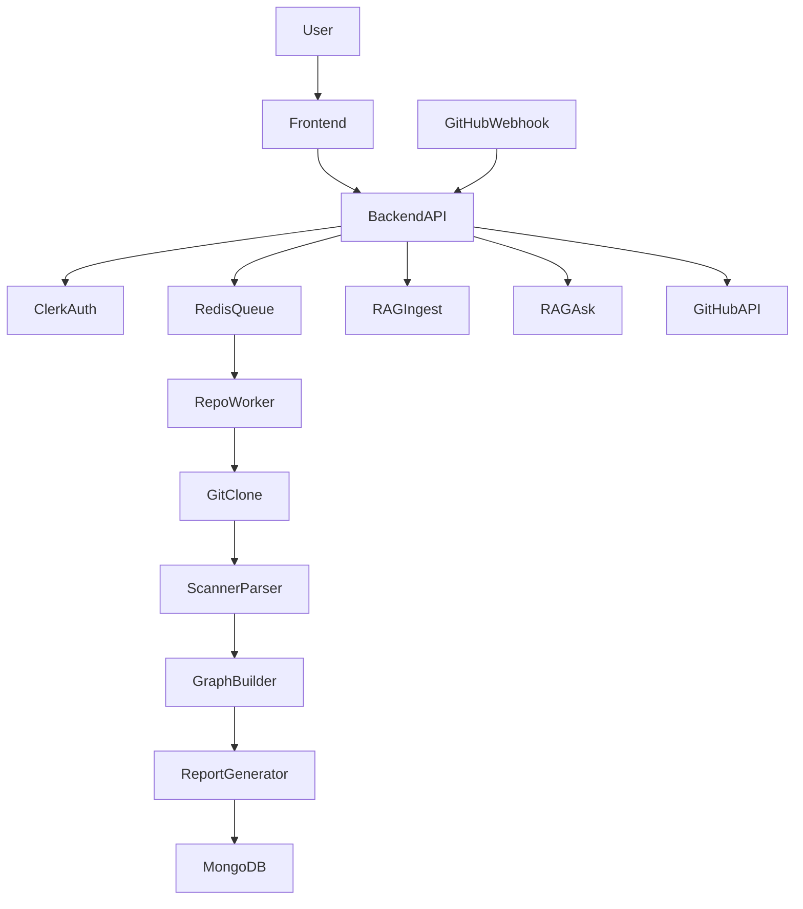

# 📦 RepoLens Backend

**Turn any GitHub repository into architecture intelligence, risk signals, and AI-queryable insights.**

RepoLens Backend is a **TypeScript/Express service** that ingests source repositories, parses code structure, builds dependency and call graphs, generates engineering reports, and powers **AI-assisted repository Q&A**.

---

# 1. Project Title

**Name:** RepoLens Backend  
**Tagline:** AI-powered repository analysis engine for engineering intelligence  

**What it does:**  
Accepts a GitHub repo URL, processes code asynchronously, stores analysis in MongoDB, and exposes APIs for graphs, reports, PR risk analysis, and chat-style AI answers.

---

# 2. 🚀 Overview

RepoLens Backend solves a common problem: **repositories are hard to understand quickly**, especially for:

- Developer onboarding
- Architecture reviews
- PR risk assessment
- Codebase exploration

It is built for:

- Engineering teams
- Tech leads and architects
- Code reviewers
- Dev tools / platform teams
- Product or management stakeholders needing engineering health signals

---

## Key Features

- Asynchronous repository ingestion using **BullMQ + Redis queue**
- Secure GitHub repo URL validation and shallow cloning
- Recursive scanning with ignored directories and file limits
- **AST-based parsing** for JS/TS/JSX/TSX via Babel
- Function call graph and file dependency graph generation
- Dead code detection and entry-point metadata
- Layer and impact analysis for architectural risk
- Versioned repo reports with trend analytics
- **AI question answering** via external RAG service
- GitHub PR webhook analysis with automated risk scoring
- Clerk-based authentication and webhook-based user provisioning
- Credit-based usage gating for feature access

---

# 3. 🏗️ System Architecture

## High-Level Architecture

1. Client sends analysis/query requests
2. API validates authentication and credit rules
3. Analysis jobs are pushed to a Redis queue
4. Worker clones, scans, and parses repository
5. Graphs and reports are generated
6. Data is stored in MongoDB
7. AI endpoints query external RAG service
8. PR webhooks trigger risk analysis and GitHub comments

---

## Components

### Frontend (external)

Separate web application that calls this backend via:

```
/api/v1/*
```

### Backend Services

- Express API layer
- Queue producer (`repoQueue`)
- Queue worker (`repoWorker`)
- Scanner, parser, graph builder, report generator
- PR analysis services

### Databases

**MongoDB**

Stores:

- repositories
- files
- functions
- imports
- calls
- reports
- users
- usage
- PR analyses

### Message Queue

**BullMQ over Redis**

Handles asynchronous repository processing.

### External APIs

- **Clerk** → authentication + user provisioning
- **GitHub API** → PR diffs + comments
- **RAG Service** → `/ingest` and `/ask`

---

## Deployment Structure

Typical setup:

```
Frontend → Vercel
Backend → Render
RAG Service → Render
Database → MongoDB Atlas
Queue → Redis
```

---

## Architecture Diagram (Mermaid)



---

# 4. 🧭 Wireframes / UI Flow

## UI Flow (Backend Connected)

```
Enter GitHub URL
      ↓
POST /api/v1/analyze
      ↓
Queue Job
      ↓
Repo Processing
      ↓
GET /api/v1/:repoId/report
      ↓
Report Page
      ↓
POST /api/v1/ask
      ↓
AI Answer
```

---

## Landing Page

```
+--------------------------------------+
| RepoLens                             |
| [ GitHub Repository URL __________ ] |
| [ Analyze Repository ]               |
+--------------------------------------+
```

---

## Repo Analysis Page

```
+--------------------------------------+
| Repo: owner/project                  |
| Status: RECEIVED -> CLONING -> ...   |
| Progress indicators                  |
+--------------------------------------+
```

---

## Report Page

```
+--------------------------------------+
| Architecture Health: 82              |
| Dead Functions: 14                   |
| Layer Violations: 3                  |
| [View Graph] [Download PDF]          |
+--------------------------------------+
```

---

## Chat Interface

```
+--------------------------------------+
| Ask about this repository            |
| [ How does auth flow work? ______ ]  |
| [ Ask ]                              |
| AI Answer                            |
+--------------------------------------+
```

---

# 5. 🛠️ Tech Stack

| Category | Technologies |
|--------|--------|
| Frontend | Vite + React (external client) |
| Backend | Node.js, TypeScript, Express 5 |
| Database | MongoDB + Mongoose |
| Queue | BullMQ, ioredis |
| AI | External RAG service |
| DevOps | Render, Vercel |
| Logging | Winston, Morgan |
| Authentication | Clerk |
| Parsing | Babel parser + traverse |
| Reporting | PDFKit, chartjs-node-canvas |

---

# 6. 📁 Folder Structure

```
repolens-backend/
├─ src/
│  ├─ app.ts
│  ├─ server.ts
│  ├─ config/
│  ├─ controllers/
│  ├─ middleware/
│  ├─ models/
│  ├─ routes/
│  ├─ services/
│  ├─ workers/
│  ├─ utils/
│  ├─ validators/
│  ├─ scripts/
│  └─ types/
├─ FORMULAS.md
├─ package.json
├─ tsconfig.json
└─ README.md
```

### Folder Descriptions

- **config/** → env validation, DB connection, logger, queue config
- **controllers/** → HTTP request handlers
- **middleware/** → auth, validation, rate limits, errors
- **models/** → Mongoose schemas
- **routes/** → API route declarations
- **services/** → business logic
- **workers/** → BullMQ job workers
- **utils/** → helper utilities
- **validators/** → request schema validation
- **scripts/** → operational scripts
- **types/** → shared TypeScript types

---

# 7. ⚙️ How It Works

1. User submits `repo_url` to `/api/v1/analyze`
2. Backend validates URL, auth, and credits
3. Repository record created with status **RECEIVED**
4. Job added to **Redis queue**
5. Worker picks job → status **CLONING**
6. Repo is shallow cloned
7. Scanner processes files
8. AST parser extracts functions/imports/calls
9. Graph builder computes call graph
10. Report generator calculates architecture metrics
11. Repo status becomes **READY**
12. Optional ingestion into **RAG service**
13. Frontend fetches reports/graphs
14. AI questions are forwarded to RAG `/ask`
15. GitHub PR webhooks trigger **PR risk analysis**

---

# 8. 📦 Installation

## Prerequisites

- Node.js **18+**
- npm
- Git
- MongoDB
- Redis
- Docker (optional)

---

## Clone Repository

```bash
git clone <your-repo-url>
cd <your-repo-root>/repolens-backend
npm install
```

---

## Start Infrastructure

```bash
docker run -d --name repolens-mongo -p 27017:27017 mongo:7
docker run -d --name repolens-redis -p 6379:6379 redis:7
```

---

# 9. 🔐 Environment Variables

Create `.env` file:

```env
PORT=5000
NODE_ENV=development
MAX_REPO_SIZE_MB=50
CLONE_TIMEOUT=20000
TEMP_DIR_PATH=C:\repos
MONGO_URI=mongodb://localhost:27017/repolens
CLERK_SECRET_KEY=your_clerk_secret_key
CLERK_WEBHOOK_SECRET=your_clerk_webhook_secret
RAG_SERVICE_URL=http://localhost:8000
GITHUB_TOKEN=your_github_token
GITHUB_WEBHOOK_SECRET=your_github_webhook_secret
```

---

## Variable Reference

| Variable | Purpose |
|--------|--------|
| PORT | HTTP server port |
| NODE_ENV | Runtime environment |
| MAX_REPO_SIZE_MB | Maximum repo size |
| CLONE_TIMEOUT | Clone timeout |
| TEMP_DIR_PATH | Local repo storage |
| MONGO_URI | MongoDB connection |
| CLERK_SECRET_KEY | Verify Clerk JWT |
| CLERK_WEBHOOK_SECRET | Verify Clerk webhook |
| RAG_SERVICE_URL | AI RAG service |
| GITHUB_TOKEN | GitHub API token |
| GITHUB_WEBHOOK_SECRET | Verify GitHub webhook |

---

# 10. ▶️ Running the Project

### Development

```bash
npm run dev
```

### Production

```bash
npm run build
npm start
```

### Utility Script

```bash
npm run migrate:credits
```

Worker is bootstrapped inside:

```
src/server.ts
```

---

# 11. 📡 API Overview

**Base URL**

```
/api/v1
```

---

## Health

| Method | Endpoint | Auth | Description |
|------|------|------|------|
| GET | /health | No | Health check |

---

## User

| Method | Endpoint |
|------|------|
| POST | /auth/clerk/webhook |
| GET | /me |
| PATCH | /me |
| GET | /dashboard-summary |
| GET | /my-repos |

---

## Repository

| Method | Endpoint |
|------|------|
| POST | /analyze |
| GET | /:repoId/structure |
| GET | /:repoId/graph |
| GET | /:repoId/file-graph |
| GET | /:repoId/report |
| GET | /:repoId/report/pdf |
| GET | /:repoId/history |
| GET | /:repoId/impact/:fileId |
| GET | /:repoId/risk-ranking |
| GET | /:repoId/layer-analysis |

---

## AI

| Method | Endpoint |
|------|------|
| POST | /ask |

---

## PR Analysis

| Method | Endpoint |
|------|------|
| POST | /webhook/github |
| GET | /:repoId/pr-analyses |
| GET | /:repoId/pr-analyses/summary |
| GET | /:repoId/pr/:prNumber |

---

## Example Request

### Analyze Repo

```json
POST /api/v1/analyze

{
  "repo_url": "https://github.com/owner/repo"
}
```

### Ask Question

```json
POST /api/v1/ask

{
  "repo_id": "<repo_id>",
  "question": "How does authentication work in this codebase?"
}
```

---

# 12. 🚢 Deployment

### Recommended Topology

```
Frontend → Vercel
Backend → Render
Database → MongoDB Atlas
Queue → Redis
RAG → Render
```

---

# 13. 🖼️ Screenshots

```
docs/screenshots/landing-page.png
docs/screenshots/repo-analysis-page.png
docs/screenshots/report-page.png
docs/screenshots/chat-interface.png
docs/screenshots/pr-analysis-view.png
```

---

# 14. 🔮 Future Improvements

- Redis env configuration (`REDIS_URL`)
- Separate worker service
- Streaming AI responses
- Support more languages (Python, Java, Go, Rust)
- Incremental repo analysis
- Security scanning / SBOM
- CI integration
- Automated testing pipeline

---

# 15. 🤝 Contributing

1. Fork the repository
2. Create a branch

```bash
git checkout -b feature/your-feature
```

3. Commit changes
4. Add tests/docs if needed
5. Open a pull request

Please follow:

- Clean TypeScript code
- Small focused PRs
- Clear API documentation updates

---

# 16. 📄 License

MIT License (placeholder).

Add a **LICENSE** file with full MIT license text before publishing.